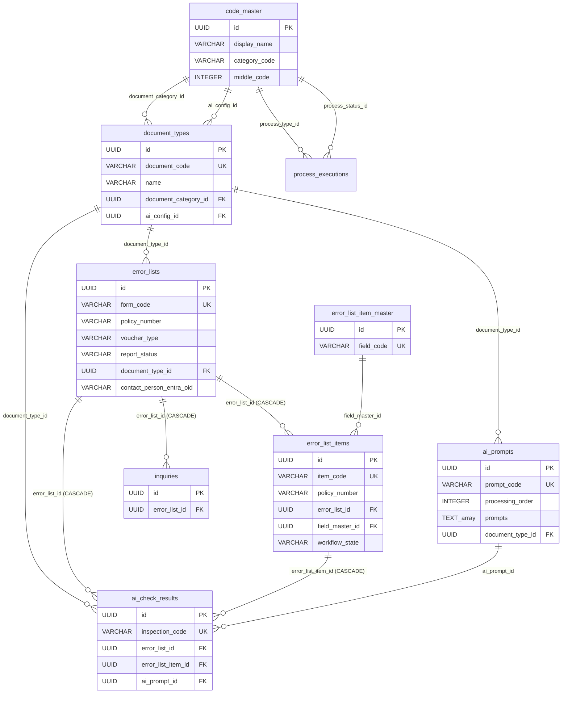
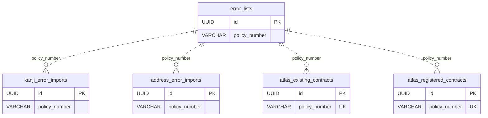
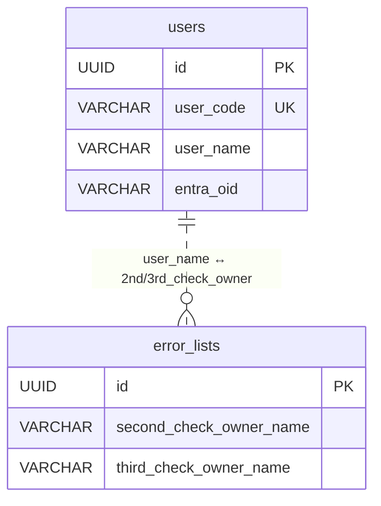

# ER 図

Mermaid で記述。GitHub / VS Code Markdown プレビューで描画可能。
外部キーと論理結合を区別する。

---

## 主要リレーション (core + settings + masters)

---

## 論理結合 (FK なし、policy_number ベース)

注: FK を張らないのは外部取込データが一時的なものであり、本体 (`error_lists`) のライフサイクルとは独立しているため。

---

## ユーザー論理結合

`error_lists.{second|third}_check_owner_name` は `users.user_name` と論理結合する (Dataverse のラウンドロビン割り当て仕様踏襲)。
商用時は `users.entra_oid` ベースの FK 化を検討。

---

## 独立テーブル (参照元・先なし)

- `japan_post_address_master` — 住所照合用 (`postal_code` 結合)
- `aflac_address_master` — 住所照合用 (`postal_code` / `address_code` 結合)
- `system_error_logs` — エラーログ
- `audit_logs` — 監査ログ
